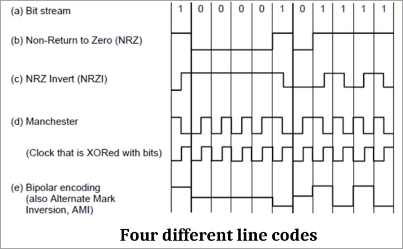

# Computer Networks

> 车啸平
>
> xpche@bjtu.edu.cn

* 考核
  * 5% Class Practice
  * 45% Assignments
    * we'll do homework on friday (biweekly)
  * 50% Final Examination (Open Book)

* References
  * 要买: Computer Networking: A Top-Down Approach (7th)

* A mini game about communication

* 16 Weeks Plan

## 1. Introduction

* Networks Model
  * Client-Server Model
  * Peer-to-peer

* Rules <=> Protocols

* Protocol layers
  * main structuring method used to divide up netowrk funcitonality
  * each protocol at different layers serves a different purpose

* wireless vs mobile

* Networks
  * PAN: Personal Area Network
  * LAN: Local Area Network (Enterprise Network)
  * MAN: Metropolitan Area Network
  * WAN: Wide Area Network

* Internet Service Provider
  * ISP provide WAN
  * Tier-1 ISP, Tier-2 ISP, ..., Local ISP, BJTU Network
  * China have only **2 Tier-1 ISP**: CN-China Telecom, CN-CHina Unicom
  * 为什么要分级：每个设备支持数量有限

* CDN

* VPN: Virtual Private Network
  * have the right to **go inside LAN**

* Internet

* Q1: 不是所有的网站都需要Internet
  * 同个LAN下的网站就不需要

* Q2: 可以用无线方法连接多个Router吗

* Q3: 使用ISP连接Internet

* History of Chinese Internet

* Social Issues of Internet

* Reference Model
  * OSI Reference Model
    * 7 Levels
      1. Physical     : sends bits as signal
      2. Data-Link    : sends frames 
      3. Network
      4. Transport
      5. Session
      6. Presentation
      7. Application
  * TCP/IP Reference Model
    * 5 Levels
      1. Physical: Bit (0 or 1)
      2. Data-Link:  Frame 
      3. Network: Datagram / Packet
        * 【Datagram和Packet的区别是connection的区别吗】
      4. Transport: Segment
      5. Application: Message
    * 信息来自应用层，并往下传递，每传递一层，会多一个**Header**
    * Router 会处理 physical, link, network
    * Switch 只处理 physical, link
    * 例，浏览器每个层使用的协议为: HTTP, TCP, IP, 802.11
      * 802.11: Wifi Protocol
      * 802.3 : Ethernet Protocol
    * 不同层有不同的协议，每个协议都有自己的Header格式
    * 一条信息，发送和接收使用的协议必须相同

* Hops
  * Jump from one router to another router, called a **hop**

* Time to Live (TTL)
  * The times that a message pack could jump

* Service provided by a layer
  * **Connection-oriented**
    * 建立一个持续连接，来传递信息
    * 如果连接中断了，就必须重新建立连接
    * 可以保证信息的顺序
    * 特征
      * Reliable message stream
      * Reliable byte stream
      * Unreliable connection
    * e.g. TCP
  * **Connectionless**
    * 不保证信息的顺序
    * 特征
      * Unreliable datagram
      * Acknowledged datagram
      * Request-reply
    * e.g. UDP

## 2. Physical and Data Link Layer

* Modem 调制解调器(猫)
  * modulation: 将光信号转换为电信号
* 物理延迟计算
  * Rate   : R (in bits per second)
  * Delay  : D (in seconds)
  * Message: M
  * Latency: L = M / R + D;
    * Transmission delay: M / R
    * Propagation delay: D
  * Speed of signal: 2/3*c = 2e8 m/s
  * 简单计算题：给出M,R,D,求L,易错点是单位换算
  * 这里的计算，只考虑物理延迟，不考虑软件延迟等
  * A long link or a slow rate means **high latency**
* Wires
  * Twisted Pair
    * Full-duplex link 全双工
      * **both directions**
    * Half-duplex link 半双工
      * both directions but **not same time**
    * Simplex link 单工
      * **single direction**
  * Fiber
    * Common for high rates and long distances
    * Too expensive
  * 为什么Twisted Pair不能传输过远的信息
    * 速度慢，信息丢失
* Wireless
  * Radio
  * Microwave: LANs and 3G/4G/5G
  * Difference between 2.4G and 5G
  * EMP原理
* Fourier Transform
* 【如何产生强烈信号以阻断信号】
* Four different **line codes**
  * 
  * NRZ
  * NRZI：变化代表1，不变代表0
  * Manchester：变化的类型表示0或1
  * AMI
* FDM（Frequency Division Multiplexing）
  * 概念：不同频率表示不同频道
  * 效率低，频道会被占用
* TDM（Time Division Multiplexing）
  * 概念：按时间切片，比如每5分钟轮换到下一个人发信号
* CDMA（Code Division Multiple Access）
  * 通过正交的Codes来在同时同频率来表示不同人发送的信息
* OFDM（Orthogonal FDM）
  * 加入了新的一个维度：Power
* 【5G用了什么新维度】

### 2.2 Data Link Layer

#### 2.3.1 Connectionless

* Types of possible services
  * **Unacknowledged connectionless** service
  * **Acknowledge connectionless** service
  * Acknowledge connection-oriented service
    * 在Data Link层非常少见
* 问题一：**如何定位信息的开头和结尾**
* 三种方法 Frame Methods
  * Byte count
  * Flag bytes with byte stuffing
  * Flag bits with bit stuffing
* **Byte Count**
  * 一个Frame的首位记录这个Frame的长度（包含首位）
  * 问题：无法纠错，并且会导致之后的信息都是错误的
  * **Extra bit**：1 Byte
* **Byte Stuffing**
  * 使用Flag来标记Frame的开头和结束
    * 形如：Flag|Information|Flag
    * Flag通常只占一个Byte
  * 使用Escape Byte来表示后一个Byte表示原信息
  * **Extra bit**：2 + ? Bytes
* **Bit Stuffing**
  * 使用连续的6个1来表示flag
  * 原始信息中，5个1多加一个0
  * **Extra bit**：2 + ? Bytes
* 问题二：如何定位错误
* Error Control
  * Error detection codes
    * **Parity**
    * **Checksums**
    * **Cyclic Redundancy Codes** (CRC)
  * Error correction codes
    * **Hamming Codes**
* **Copy**
  * **Extra bit**：n Bytes
* **Parity**
  * **Extra bit**：1 bit
* **Checksums** 校验和
  * 把多个字节拼在一起，算出和，若溢出则继续加，最后将位翻转
* **Cyclic Redundancy Codes**
  * 设置一个Generator（例如10011），然后在原数据末尾补上Generator位数-1个0，用异或除法去除原数据，得到余数，再把余数加在原数据后
  * **Extra bit**：Genrator位数-1 bit
    * 所以通常的32-bit CRC的Generator有33位
  * 如何得到Generator？
    * 规定的
