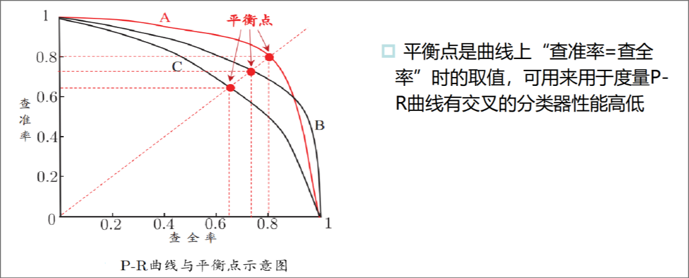
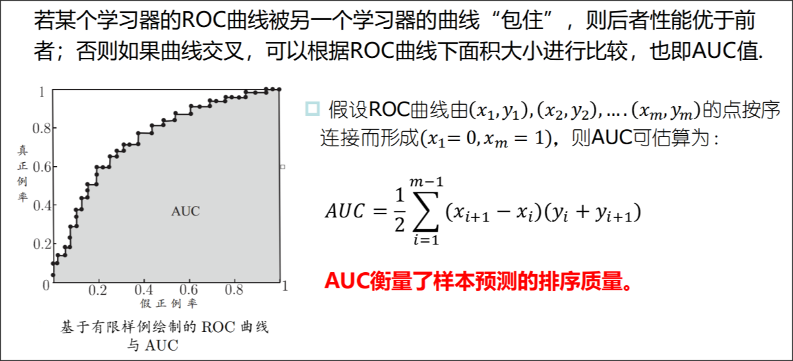
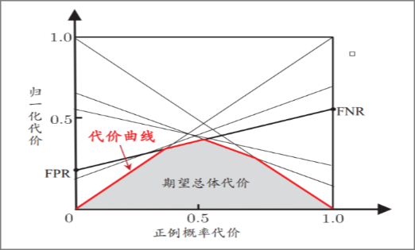
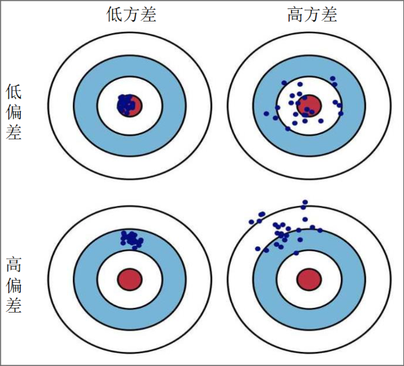
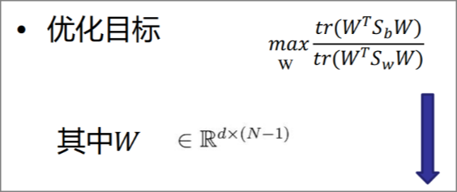
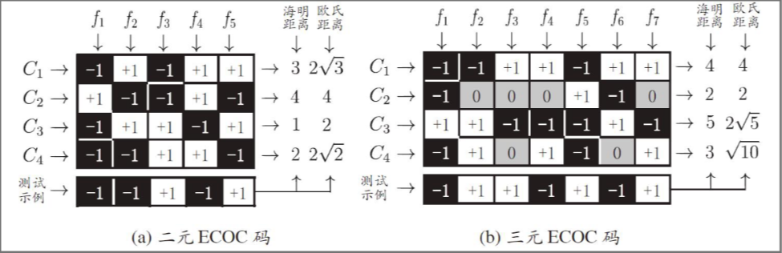
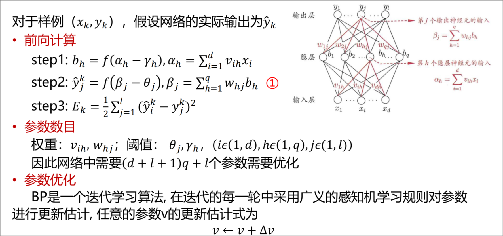

# cMachine Learning

> 吴雨婷
>
> ytwu1@bjtu.edu.cn

## 0. 课程

* 课程目标

* 主要内容
  * 有监督学习过渡到无监督学习

* 考核方式
  * 20%作业 + 30%实验 + 50%考试(半开卷)
  * 8次小作业
  * 半开卷: 能带一张A4纸

* 答疑
  * 周一下午 16:10-18:00
  * YF706

## 1. 绪论

### 1.1 背景

* 概念
  * 计算机利用经验改善系统自身性能的行动
  * 三个重要的理论问题
    * 一致: 样本集和测试集i.i.d
    * 划分: 在样本空间内寻找决策分界面
    * 泛化: 对未知样本的判断能力
    * i.i.d: 独立同分布

* 范围

* 应用

* 发展历史

* 知名人物
  * 深度学习三巨头

### 1.2 基本知识

* 机器学习的类型
  * 监督学习
  * 无监督学习
  * 强化学习

* 基本术语
  * (略)
  * **假设空间**
    * 定义：所有属性的可能性(可能取值)组成的空间
    * 每维属性还包含一个通配符，并且存在空集
    * 所以比如3个属性，每个属性有3种取值
    * 则 **总假设空间大小** 为 4\*4\*4 + 1 = 65
  * **版本空间**
    * 定义：多个与训练集一致的 **假设**
  * **归纳偏好**
    * 定义：学习过程中对某种类型假设的偏好
    * 每种算法必有其归纳偏好
    > "奥卡姆剃刀" 原则

* No Free Lunch: 每个算法都有其优势
  * 西瓜书的特例证明，假设 **所有问题出现的概率相同**，则得到对于二分类问题：**总误差和学习算法无关**
    * 但现实中，**问题出现概率并不同**，所以每个算法都有它的优势

* 统计学习 三要素
  * 模型
  * 策略
    * 损失函数 Loss Function
    * 风险函数 Risk Function
  * 算法

### 1.3 机器学习 开发流程

* 一般步骤
  * 数据收集
  * 数据清洗
  * 特征工程
  * 数据建模

### 1.4 模型的评估和选择

* 指标
  * Error Rate
  * Accuracy   = (TP + FN) / (TP + FN + FP + TN)
  * Precision  = TP / (TP + FP)
  * Recall     = TP / (TP + FN)
  * Loss

* 拟合问题
  * 过拟合
    * 解决方法：优化目标加正则项、early stop
  * 欠拟合

* 评估方法
  * 留出法
  * 交叉验证法
    * 如：10折交叉验证
  * 留一法
  * 自助法

* 性能度量
  * 回归任务
    * 最常用的是：均方误差
      * $ E(f;D) = \Large \frac{1}{m} \sum_{i=1}^{m}(f(x_i)-y_i)^2 $
  * 分类任务
    * 最常用的是：ErrorRate，Accuracy
    * Precision 与 Recall 往往是矛盾的
  * **P-R 曲线**
    * 算出所有样本的正例概率，然后使用这些正例概率分别作为阈值，得到混淆矩阵
    * 将每个混淆矩阵转换为一个点对 (R, P)
    * 将这些点绘制在平面直角坐标系上，得到 P-R 曲线
    * 将曲线上 "P=R" 的点，称为 **平衡点(Break-event Point)**
    * **平衡点**，用于衡量P-R曲线有交叉的分类器性能高低
    * 
  * **F1度量** (F1-Score)
    * $ F1 = \Large \frac{2 \times P \times R}{P + R} \normalsize = \Large \frac{2 \times TP}{样例总数 + TP - TN} $
    * $ F_{\beta} = Large \frac{(1+\beta^2)\times P \times R}{(\beta^2 \times P) + R} $
      * 当 $ \beta = 1 $ 时，标准 $F_1$
      * 当 $ \beta > 1 $ 时，偏重recall（如逃犯信息检索）
      * 当 $ \beta < 1 $ 时，偏重precision（如商品推荐系统）
  * **macro-F1**
    * 当需要对多个混淆矩阵做性能度量时，可以使用 **macro-F1**
    * **macro-P**: $P_i$ 的均值
    * **macro-R**: $R_i$ 的均值
    * **macro-F1**: 通过 macro-P 和 macro-R 算出 macro-F1
    * 先取均值，再计算 $F1$
  * **micro-F1**
    * 先计算出 $F1_i$，再取均值
  * **ROC图**
    * 类似P-R曲线，先对样本排序，再将样本逐个作为阈值得到多个点
    * 纵轴: $ TPR = \Large \frac{TP}{TP+FN} $
      * $ FNR = 1 - TPR $
    * 横轴: $ FPR = \Large \frac{FP}{FP+TN} $
      * $ TNR = 1 - FPR $
    * 阈值从高到低时，设前一个点为(x, y)，则下一个点为 $ (x, y + \frac{1}{m^+}) $ 或 $ (x + \frac{1}{m^-}, y) $
      * 这个性质可以用于加速图像的绘制
    * AUC: Area Under Curve
      * 曲线下方面积，用于衡量样本预测的排序质量（正样本尽量靠前，负样本尽量靠后）
    * 
    * 问题：为什么阈值要取样本的确切点呢？
      * 因为连续值没有意义，样本是离散的！
  * 代价敏感错误率
    * 设定“代价矩阵”，令 $cost_{ij}$ 表示将第 $i$ 类样本预测成 $j$ 的代价
    * 就是给错误率加权
    * $cost_{01}$：把正例预测成负例的代价
  * **代价曲线**
    * 横轴：取值为 [0, 1] 的正例概率代价
      * $ P(+)cost = \Large \frac{p*cost_{01}}{p*cost_{01} + (1-p)*cost_{10}} $
      * $p$：随机抽一个样本，正例概率（比例）
      * $p*cost_{01}$：正例预测错的期望花费
      * $p*cost_{01} + (1-p)*cost_{10}$：预测错的期望花费
    * 纵轴：取值为 [0, 1] 的归一化代价
      * $ cost_{norm} = \Large \frac{FNR * p * cost_{01} + FPR * (1-p) * cost_{10}}{p*cost_{01} + (1-p)*cost_{10}} $
      * 实际上，就是 $ 正例预测错的概率 * 正例概率代价 + 负例预测错的概率 * 负例概率代价 $
    * 如何绘制代价曲线
      * 设 ROC上的一个点为 (FPR, TPR)
      * 则 将该点转化为代价曲线上的一条线段
      * $ x = P(+)cost $
      * $ y = FNR * x + FPR * (1 - x) $
      * $y$ 显然是关于 $x$ 的一条直线，但 $x$ 有取值范围，所以这是一条线段
    * 取所有线段下方面积的交集，即为 **所以条件下，该学习器的期望总体代价**
      * 所有线段产生贡献的部分，称为 **代价曲线**
      * 
    * 作用
      * 可以或得到每种正例概率代价下，最优的阈值
  * 偏差 与 方差
    * 方差 Variance
    * 偏差 Bias
    * 
    * 偏差：算法本身的拟合能力
    * 方差：数据扰动所造成的影响
    * 噪声：学习问题本身的难度（任务本身、数据集本身）
    * 期望泛化误差 $E(f;D) = E_D[(f(x;D)-\bar{f}(x))^2] + (\bar{f}(x)-y)^2+E_D[(y_D-y)^2]$
      * 即 $E(f;D)=bias^2(x)+var(x)+\epsilon^2$
    * 偏差-方差窘境
      * 训练初期，拟合能力不强，偏差主导泛化错误率
      * 训练加深，拟合能力增强，方差主导泛化错误率
      * 训练充足，拟合能力非常强，若训练数据自身的、非全局的特性被学到，则会发生过拟合

***

## 2. 线性模型

### 2.1 线性回归

#### 2.1.1 线性回归

* 回归的概念
  * 回归：连续
  * 分类：离散
* 线性回归
  * 一种通过属性的 **线性组合** 来进行预测的 **线性模型**
  * 一般形式：$f(x) = w_1x_1+w_2x_2+...+w_dx_d+b$
  * 向量形式：$f(x)=w^Tx+b$
    * $x = (x_1;x_2;...;x_d)$
    * 若向量的划分符号为 $;$ 则表示列向量
  * 最小二乘法：基于均方误差最小化
    * 均方误差：$J(w, b) = \sum_{i=1}^{m}(y^{(i)}-wx^{(i)}-b)^2$
    * 目标：$argmin_{(w,b)} \ J(w, b)$
    * 机器学习凸函数定义：$f(x_1+x_2)  \leq f(x_1) + f(x_2)$
    * 根据 $\Large\frac{\partial J(w, b)}{b}\normalsize = 0$，得到 $b = \bar{y} - w \bar{x}$
    * 根据 $\Large \frac {\partial J(w, b)}{\partial w} \normalsize = 0$，得到 $w = \Large \frac{\sum_{i=1}^{m} (x^{(i)}-\bar{x})(y^{(i)}-\bar{y}) }{ \sum_{i=1}^{m}(x^{(i)}-\bar{x})^2 }$
    * 【作业：证明最小二乘法】
  * 000000：基于残差平方和最小化
    * 残差平方和：$J(w) = \frac{1}{2} \sum_{i=1}^{m} (h(x^{(i)})-y^{(i)})^2$
* 度量误差
  * 损失函数 Loss Function：单样本预测的错误
  * 代价函数 Cost Function：全部样本集的平均误差
  * 目标函数 Object Function：最终需要优化的函数
* 广义线性模型
  * 一般形式：$y=g^{-1}(w^Tx+b)$
  * 当 $g(·)=ln(·)$ 时，为对数线性回归

#### 2.1.2 梯度下降

* 梯度下降的三种形式
  * 批量梯度下降（Batch Gradient Descent, BGD）
    * 梯度下降的每一步，都用到了 **所有** 的训练样本
    * $w_j := w_j - \alpha \frac{1}{m} \sum_{i=1}^{m} ((h(x^{(i)})-y^{(i)})· x_j^{(i)})$
    * $\sum$ 内部的项，即为 **梯度**，即 $\Large\frac{\partial \ J(w)}{\partial \ w_j}$
    * 优点：考虑所有样本；缺点：太慢
  * 随机梯度下降（Stochastic Gradient Descent, SGD）
    * 梯度下降的每一步，随机一个样本训练
    * $w_j := w_j - \alpha \Large \frac{\partial \ J(w)}{\partial \ w_j}$
  * 小批量梯度下降（Mini-Batch Gradient Descent, MBGD）
    * 梯度下降的每一步，用到了 **一定批量** 的训练样本

* 梯度下降 和 最小二乘法
  * 梯度下降 需要超参 **学习率$\alpha$**
  * 最小二乘法，需要矩阵求逆

* 数据归一化/标准化
  * 归一化
    * $x^* = \Large \frac {x - x_{min}} {x_{max} - x_{min}}$
  * Z-Score标准化
    * $x^* = \Large \frac  {x - \mu} {\sigma} $

* 过拟合/欠拟合

### 2.1.3 正则化

* 正则化值（**结构风险函数**），可以用于衡量模型复杂度
  * 模型越复杂，正则化值越高
  * 正则化项是一个项，会加在代价函数的最后面
  
* L1正则化，Lasso回归
  * 更容易使得模型的权重变为0（换句话说，可以用于特征选择）

* L2正则化，岭回归
  * 相比L1，更加平滑，容易使得模型的权重趋近0

*【公司面试常考的，L1正则和L2正则的区别，区别产生的原因】

* Elastic Net，弹性网络
  * L1和L2的均值

### 2.1.4 回归的评价指标

* 均方误差 MSE
  * 缺点：存在平方；量纲不同

* 均方根误差 RMSE
  * 缺点：存在平方（所以容易受到一些属性特大误差的影响）

* 平均绝对误差 MAE
  * 缺点：不能求导

* R方 R2Score
  * $ R^2(y,\hat{r}) = 1 - \Large \frac {MSE} {Var} $
  * 越接近1，说明模型拟合得越好

### 2.2 逻辑回归

#### 2.2.1 & 2.2.2 分类问题 & 逻辑回归概述

* 二分类、多分类
* 如何将回归问题转换为分类问题？
  * 分类器
  * 单位阶跃函数：不可导
  * 对数几率函数 Sigmoid：$\sigma(z) = \Large \frac {1} {1 + e^{-z}} $
  * 二分类的损失函数，我们通常这么定义
    * $ J(\theta) = \Large \frac{1}{m} \normalsize \sum_{i=1}^{m} Cost(h_{\theta}(x^i, y^i)) $
    * $ Cost(h_{\theta} (x^i, y^i)) = -log(h_{\theta}(x))[y==1] + -log(1-h_{\theta}(x))[y==0]$
    * 得到逻辑回归的假设函数（即损失函数）
      * $L(\hat{y}, y) = -ylog(\hat{y})-(1-y)log(1-\hat{y})$
* 几率（事件发生比）
  * 定义：$\Large \frac{p}{1-p}$

* 对数几率
  * 定义：$log \Large \frac{p}{1-p} \normalsize = w^T x + b = z$
  * 求解得到对数几率函数：$g(z) = p = \Large \frac{1}{1+e^{-z}}$
  * 导数：$g'(z) = g(z)(1-g(z))$
  * 【回去推一下】

* 逻辑回归模型的假设是：

#### 2.2.3 逻辑回归求解

* 似然函数是已知事件的结果，求参数
  * $P(y|\theta)$：若已知 $\theta$，求 $y$ 发生的概率，这是概率
  * 如果已知 $y$，求一个最合适的 $\theta$，求最可能发生 $y$，这是似然函数
* 似然函数
  * $L(w) = \Pi_{i=1}^{m} P(y^{(i)}|x^{(i)}; w)$
  * 因为梯度下降还是需要求导，所以对上式取对数，将连乘化简为连加
  * 得到代价函数 $J(w) = -1/m\  logL(w)$
* 【可不可以把学习的过程，理解成最大化似然函数的过程】

### 2.3 线性判别分析

* 线性判别分析（Linear DiscriminantAnalysis LDA）
* 核心思想
  * 同类点投影点尽可能近，协方差尽可能小
  * 异类点投影点尽可能远，中心之间距离尽可能大
* 一些定义
  * $X_I$：第i类样本的集合
  * $\mu_i$：第i类样本的均值向量
  * $\Sigma_i = \Sigma_{x\in X_i}(x-\mu_i)(x-\mu_i)^T$：第i类样本的协方差矩阵
  * $w^T\mu_0$：两类样本的中心在直线上的投影（内积）
  * $w^T\Sigma_0w$：两类样本投影点的协方差
  * etc.
* 拉格朗日乘子法
  * 若需要最小化 $-w^TS_bw + \lambda(w^T S_w w - 1)$
    * 对函数求偏导
    * 得到 $S_b w = \lambda S_w w$
    * 此时，$S_b$ 和 $(\mu_0-\mu_1)$ 是 **同向向量**
      * 拆开，发现后面两个矩阵的结果是标量

* LDA的贝叶斯决策论解释
  * 若两类数据同先验、满足高斯分布且协方差相等时
  * 则LDA达到最优分类

* LDA推广——多分类任务
  * 全局散度矩阵、类内散度矩阵、类间散度矩阵
  * 
  * $tr(A)$：trace，矩阵的迹
    * 矩阵对角线元素相加

* LDA的另外一个作用：监督降维
* 算法流程
  * 略

### 2.4 多分类学习

* 多分类学习方法
  * 二分类推广到多分类
  * 利用二分类学习器解决多分类**（常用）**
    * 对问题进行拆分
* 拆分策略
  * 一对一：拆分成 $C(n, 2)$，然后取最多
  * 一对其余：拆分成 $n$ 个，然后 $1$ 正例 $n-1$ 反例
  * 多对多
    * 若干类为正类，若干类为反类，每次输出一些纠错输出码（ECOC）
    * 二类：正类 + 反类
    * 三类：正类 + 反类 + 停用类
    * 

### 2.5 类别不平衡

#### 2.5.1 概述

* 真样本数过少（比如系外行星宜居度预测）

#### 2.5.2 困难点

#### 2.5.3 解决方法

* 将二分类正反例阈值调整为 $\Large \frac{p}{1-p}$
* 这就是类别不平衡学习的一个基本策略——**再缩放(Rescaling)**
  * 欠采样：去除一些负例，使得正反例数目接近
  * 过采样：增加一些正例，使得正反例数目接近
  * 阈值移动

### 2.6 优化提要

* 各个模型的优化目标
  * 最小二乘法：最小化均方误差
  * 逻辑回归：

***

## 3. 感知机与神经网络

### 3.1 历史

### 3.2 神经元模型

* MP神经元模型
* 激活函数

### 3.3 感知机 Perceptron

* 只能处理线性可分的问题

> 机器学习基本思路：模型（网络）、策略（损失函数）、算法（极小化损失函数（梯度下降））

* 损失函数
  * 选择一：误分类点的数量 —— 不连续且不可导，不易优化
  * 选择二：误分类点到超平面S的总距离
* 优化方式
  * 原始形式
    * 随机梯度下降 
    * 感知机模型 $f(x) = sign(w \cdot x + b)$
    * 算法流程
      1. 选取初值 $w_0, b_0$
      2. 在训练集中选取数据 $(x_i, y_i)$
      3. 如果 $y_i(w \cdot x_i+b)\leq 0$，则进行梯度下降
         * 梯度下降时，$w \leftarrow w + y_ix_i$，$b \leftarrow b + \eta y_i$
      4. 转至2，直至训练集中没有误分类点
  * 对偶形式：将 $y_i$ 也作为一个变量
    * 感知机模型 $f(x) = sign(\Sigma_{j=1}^{N} \alpha_jy_jx_j \cdot x + b)$
    * 算法流程
      1. 选取初值 $\alpha \leftarrow 0$, $b \leftarrow 0$
      2. 在训练集中选取数据 $(x_i, y_i)$
      3. 如果 $y_i f(x) \leq 0$，则梯度下降
         * 梯度下降时，$ \alpha_i \leftarrow \alpha_i + \eta$，$b \leftarrow b + \eta y_i$
      4. 转至2，直至没有误分类数据
    * 可以进行预处理，处理出 **Gram矩阵**
      * $G = [x_i \cdot x_j]_{N\times N}$
* 多层感知机
  * 可以解决异或问题
* 多层前馈神经网络，FFN，Feed Forward Network
  * 前馈：输入层接收输入，隐含层与输出层对神经元进行加工，输出层给出输出
  * 多层网络：包含至少隐含层的网络

### 3.4 误差逆传播算法

* 误差逆传播算法（Error BackPropagation，简称BP）
  * *“大家要掌握前馈神经网络的反向传播算法的推导”*
  * $\theta_j$ 输出层第 $j$ 个神经元的阈值
  * $\gamma_h$ 隐含层第 $h$ 个神经元的阈值
  * $v_{ih}$ 输入层与隐层神经元之间的连接权重
  * $w_{hj}$ 隐层与输出层神经元之间的连接权重
  * 隐含层第 $h$ 个神经元的输出：$b_h = f(\alpha_h - \gamma_h)$
    * $f(x)$ 是激活函数
* 
