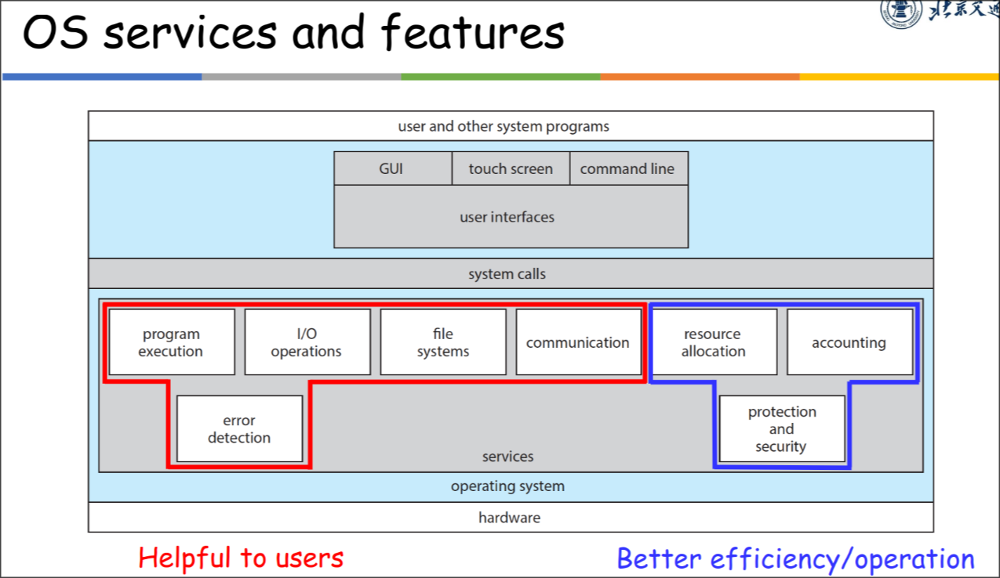
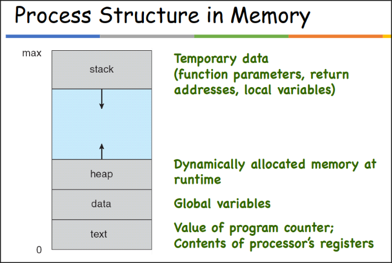
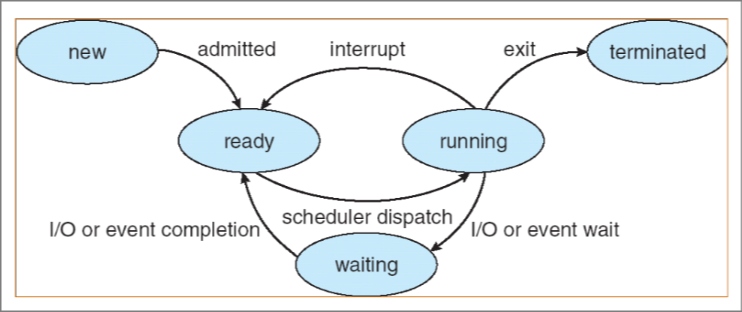
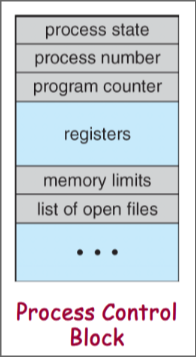

# Operating System

> 张迪
>
> dizhang@bjtu.edu.cn

## 0. Course Overview

* 课程安排
  * 双周周五实验课
  * 答疑：Thu 12:00-14:00, YF West 708

* Learning Objectives
  * OS concepts and algorithms
  * 对现实的OS有深入的理解

* Grading
  * Homework and class quiz: 20%
  * Experiments: 30%
    * Create an OS using Rust
  * Final exam: 50%
    * close book
    * 编程题考 XinHaoLiang, 如何使用 XHL 来避免死锁
  * Bonus points
    * Extra homework
    * Experimental Project Innovation

## 1. Introduction

### 1.1 Basic Introduction

* Layers of a Computer System
  * Applications - Utilities - OS - Hardware

* What is an OS?
  * **No universally accepted** defination
  * One defination
    * a system software to manage hardware resources, control program running, improve man-machine interface and provide support for application software
  * Another defination
    * Resource Manager
      * each program gets time
      * each program gets space
      * decides between conflicting requests
    * Extended Machine + User Interface
      * hides the messy details
      * easier to use
      * executes user programs

* OS software classification
  * Shell: Command line interface
  * GUI: Graphical user interface
  * Kernel: The interior of the operating system

* Characteristics of an OS
  * Concurrency
  * Sharing
  * Virtualization
  * Asynchronization

* Why are we studying OS?

* How to learn OS?

* What OSes are there?
  * Microsoft OS: MS DOS, MS Windows 3.x, ...
    * DOS: Disk OS
  * UNIX: BSD, SRV4, OSF1, ...
  * Linux: Fedora, Ubuntu, Debian, Archlinux, ...
  * Embedded OS: WinCE, Symbian, uClinux, ...
    * 嵌入式操作系统
  * Moblie OS: Android, iOS, HarmonyOS, ...

### 1.2 History and Evolution of OS

* History Phase 1
  * Uni-programming & Multi-programming
    * **Multi-programming** (多道程序设计): During the idle wait time, we can run a third or more tasks.
    * 因为IO占时间，所以需要multi-programming，为了提高效率

* History Phase 2
  * Interactive time-sharing
    * **Time-sharing** (分时): cpu时间被分给多个用户，多个用户可以通过终端同时访问系统
    * Time-sharing is logical extension in which CPU switches

* History Phase 3
  * GUI

* Histroy Phase 4 (1989-)
  * Distributed Systems
  * Network

* History Phase 5 (1995-)
  * Mobile Systems

### 1.3 How OS work?

* How does an OS work
  * When a computer boots, it needs to run a first program: **the bootstrap program**
    * Typically stored in the read only memory (ROM)
    * Generally known as the **firmware** or **bootloader**
  * The bootstrap program initializes the Computer
    * Register content, device controller contents, etc.
  * It then locates and loads the **OS kernel** into memory
  * The kernel starts the first process (called "init" on Linux)
  * And then, nothing happends until an **event** occurs
    * OS开始等待某些事件的发生

* OS is running
  * load code to memory
  * memory protection
  * The kernel is NOT a running job
    * It's code that **resides in memory** and **is ready to be executed** at any moment (when some event occurs)

* A note on kernel size
  * **not use too much memory**
  * **no memory protection**

* Proteced instructions
  * A subset of instructions that only the OS can execute

* User mode vs Kernel mode
  * User mode 用户态: protected instructions cannot be executed
  * Kernel mode 内核态：all instructions can be executed
  * CPU中有一个 a protected control register，上面有一个 **status bit / mode bit (标记位/状态位)**，存当前状态

* OS events
  * The OS can be seen as a **huge event handler**
  * There are 2 kinds of events: **interrupts** and **traps**
    * interrupts: 中断通常由外部事件导致(硬件)
    * traps: 用户程序需要执行一些kernel mode才能执行的指令

* System calls 系统调用
  * A system call is a special kind of trap

* Timers
  * OS通过Timer来管理CPU占用

### 1.4 Main OS Components

* Main OS Components
  * Process Management
    * Process 就是正在运行的 Program
    * dead-lock
  * Memory Management
    * 注：Cache不归OS管，是硬件管理的
  * Storage Management
    * 文件系统etc.
  * I/O Management
  * Protection and Security

## 2. OS Structures

* 

* User Interface
  * Command Line Interface (CLI)
  * Graphics User Interface (GUI)

* System Calls
  * 通常以API的形式实现
  * 常见的APIs
    * Win32 API
    * POSIX API
    * Java API
  * 例: open()
  * Types of system calls
    * etc.

* System Services

* Why applications are OS specific?
  * 可执行程序的格式不同
  * 每个操作系统都有 **独特的system calls**
  * 跨平台应用
    * 虚拟机
    * 解释器

*【交叉编译，在windows下编译一个linux可执行程序】
  * 酷

*【看一下linux和windows可执行程序的差异】
  * 直接看看不了

* Operating System Design and Implementation
  * Goals
    * User goals
    * System goals
  * **The separation of policy from mechanism 策略和机制分离原则**
    * Policy 策略：What will be done?
    * Mechanism 机制：How to do it?
    * 策略和机制分离，是OS的最重要的原则之一
  * Languages to implement OS
    * Early OSes in **assembly** language
    * Then system programming languages like **Algol, PL/1**
    * Now **C, C++, Rust**
    * Actually usually **a mix of languages**
      * assembly + C/C++/Rust

*【计算机程序设计艺术，一本好书】
  * 好像不如多打打算法竞赛

* OS Structures
  * 类型
    * Simple - MS-DOS
    * More complex - UNIX
    * Layered - an abstraction
    * Microkernel - Mach
  * 宏内核
    * 把很多功能全塞进Kernel
    * 例：UNIX
  * 微内核
    * 把功能尽可能剥离出Kernel
  * Layered
    * make OS into severals of layers
  * Loadable Kernel Module
    * 可动态加载的内核模块
  * **Hybrid combines** 现代OS会混合多种架构

## 3. Processes

*【任务管理器，设置进程的优先级】
  * win11在"详细信息"中可以设置

### 3.1 Process Concept

* **Process** is a **program** in execution

* Process Structure in Memory
  * 栈: 局部
  * 堆: 主动申请
  * 数据段: 静态、全局
  * 代码段: 代码
  * 

* Process State
  * **new**
  * **running**
  * **waiting**: 等待某些事件发生（如IO完成）
  * **ready**
  * **terminated**
  * 上下文切换：切换进程状态
  * 
  
* Process Control Block (PCB)
  * **Information** associated with **each** process
    * Identifier
    * Process state
    * etc.
  * 在切换进程时，进行的 **上下文切换**，这里切换的就是 **PCB**
    * 

### 3.2 Process Scheduling

* Process可以被如下描述
  * I/O-bound process
  * CPU-bound process

* Process Scheduling Queues
  * Job queue
  * Ready queue
  * Device queue

* Scheduler 调度器
