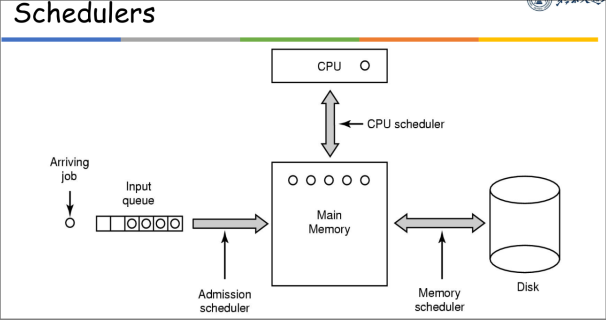
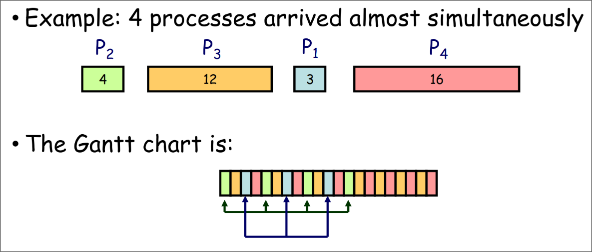

# Operating System

> 张迪
>
> dizhang@bjtu.edu.cn

## 0. Course Overview

* 课程安排
  * 双周周五实验课
  * 答疑：Thu 12:00-14:00, YF West 708

* Learning Objectives
  * OS concepts and algorithms
  * 对现实的OS有深入的理解

* Grading
  * Homework and class quiz: 20%
  * Experiments: 30%
    * Create an OS using Rust
  * Final exam: 50%
    * close book
    * 编程题考 XinHaoLiang, 如何使用 XHL 来避免死锁
  * Bonus points
    * Extra homework
    * Experimental Project Innovation

## 1. Introduction

### 1.1 Basic Introduction

* Layers of a Computer System
  * Applications - Utilities - OS - Hardware

* What is an OS?
  * **No universally accepted** defination
  * One defination
    * a system software to manage hardware resources, control program running, improve man-machine interface and provide support for application software
  * Another defination
    * Resource Manager
      * each program gets time
      * each program gets space
      * decides between conflicting requests
    * Extended Machine + User Interface
      * hides the messy details
      * easier to use
      * executes user programs

* OS software classification
  * Shell: Command line interface
  * GUI: Graphical user interface
  * Kernel: The interior of the operating system

* Characteristics of an OS
  * Concurrency
  * Sharing
  * Virtualization
  * Asynchronization

* Why are we studying OS?

* How to learn OS?

* What OSes are there?
  * Microsoft OS: MS DOS, MS Windows 3.x, ...
    * DOS: Disk OS
  * UNIX: BSD, SRV4, OSF1, ...
  * Linux: Fedora, Ubuntu, Debian, Archlinux, ...
  * Embedded OS: WinCE, Symbian, uClinux, ...
    * 嵌入式操作系统
  * Moblie OS: Android, iOS, HarmonyOS, ...

### 1.2 History and Evolution of OS

* History Phase 1
  * Uni-programming & Multi-programming
    * **Multi-programming** (多道程序设计): During the idle wait time, we can run a third or more tasks.
    * 因为IO占时间，所以需要multi-programming，为了提高效率

* History Phase 2
  * Interactive time-sharing
    * **Time-sharing** (分时): cpu时间被分给多个用户，多个用户可以通过终端同时访问系统
    * Time-sharing is logical extension in which CPU switches

* History Phase 3
  * GUI

* Histroy Phase 4 (1989-)
  * Distributed Systems
  * Network

* History Phase 5 (1995-)
  * Mobile Systems

### 1.3 How OS work?

* How does an OS work
  * When a computer boots, it needs to run a first program: **the bootstrap program**
    * Typically stored in the read only memory (ROM)
    * Generally known as the **firmware** or **bootloader**
  * The bootstrap program initializes the Computer
    * Register content, device controller contents, etc.
  * It then locates and loads the **OS kernel** into memory
  * The kernel starts the first process (called "init" on Linux)
  * And then, nothing happends until an **event** occurs
    * OS开始等待某些事件的发生

* OS is running
  * load code to memory
  * memory protection
  * The kernel is NOT a running job
    * It's code that **resides in memory** and **is ready to be executed** at any moment (when some event occurs)

* A note on kernel size
  * **not use too much memory**
  * **no memory protection**

* Proteced instructions
  * A subset of instructions that only the OS can execute

* User mode vs Kernel mode
  * User mode 用户态: protected instructions cannot be executed
  * Kernel mode 内核态：all instructions can be executed
  * CPU中有一个 a protected control register，上面有一个 **status bit / mode bit (标记位/状态位)**，存当前状态

* OS events
  * The OS can be seen as a **huge event handler**
  * There are 2 kinds of events: **interrupts** and **traps**
    * interrupts: 中断通常由外部事件导致(硬件)
    * traps: 用户程序需要执行一些kernel mode才能执行的指令

* System calls 系统调用
  * A system call is a special kind of trap

* Timers
  * OS通过Timer来管理CPU占用

### 1.4 Main OS Components

* Main OS Components
  * Process Management
    * Process 就是正在运行的 Program
    * dead-lock
  * Memory Management
    * 注：Cache不归OS管，是硬件管理的
  * Storage Management
    * 文件系统etc.
  * I/O Management
  * Protection and Security

## 2. OS Structures

* 

* User Interface
  * Command Line Interface (CLI)
  * Graphics User Interface (GUI)

* System Calls
  * 通常以API的形式实现
  * 常见的APIs
    * Win32 API
    * POSIX API
    * Java API
  * 例: open()
  * Types of system calls
    * etc.

* System Services

* Why applications are OS specific?
  * 可执行程序的格式不同
  * 每个操作系统都有 **独特的system calls**
  * 跨平台应用
    * 虚拟机
    * 解释器

*【交叉编译，在windows下编译一个linux可执行程序】
  * 酷

*【看一下linux和windows可执行程序的差异】
  * 直接看看不了

* Operating System Design and Implementation
  * Goals
    * User goals
    * System goals
  * **The separation of policy from mechanism 策略和机制分离原则**
    * Policy 策略：What will be done?
    * Mechanism 机制：How to do it?
    * 策略和机制分离，是OS的最重要的原则之一
  * Languages to implement OS
    * Early OSes in **assembly** language
    * Then system programming languages like **Algol, PL/1**
    * Now **C, C++, Rust**
    * Actually usually **a mix of languages**
      * assembly + C/C++/Rust

*【计算机程序设计艺术，一本好书】
  * 好像不如多打打算法竞赛

* OS Structures
  * 类型
    * Simple - MS-DOS
    * More complex - UNIX
    * Layered - an abstraction
    * Microkernel - Mach
  * 宏内核
    * 把很多功能全塞进Kernel
    * 例：UNIX
  * 微内核
    * 把功能尽可能剥离出Kernel
  * Layered
    * make OS into severals of layers
  * Loadable Kernel Module
    * 可动态加载的内核模块
  * **Hybrid combines** 现代OS会混合多种架构

## 3. Processes

* 【任务管理器，设置进程的优先级】

  * win11在"详细信息"中可以设置

### 3.1 Process Concept

* **Process** is a **program** in execution
  * program: passive, static, permanence

  * process: active, dynamic, temporary

* Process Structure in Memory
  * 栈: 局部
  * 堆: 主动申请
  * 数据段: 静态、全局
  * 代码段: 代码
  * 
* Process State
  * **new**
  * **running**
  * **waiting**: 等待某些事件发生（如IO完成）
  * **ready**
  * **terminated**
  * 上下文切换：切换进程状态
  * 
* Process Control Block (PCB)
  * **Information** associated with **each** process
    * Identifier
    * Process state
    * CPU scheduling information (e.g., priority)
    * Program counter: **next** instruction to be executed
    * etc.
  * 在切换进程时，进行的 **上下文切换**，这里切换的就是 **PCB**
    * 

### 3.2 Process Scheduling

* Process可以被如下描述
  * CPU执行一段时间，然后等待IO，再重复
  * I/O-bound process
  * CPU-bound process
* Process Scheduling Queues
  * Job queue: all processes
  * Ready queue: ready and waiting processes
  * Device queue: waiting for I/O devices
* Scheduler 调度器
  * Long-term scheduler (or job/admission scheduler)
    * 频率：比较低，约几分钟一次
    * 功能：从外部存储器上选择进程，并把进程放到内存及ready queue里
  * Short-term scheduler (or CPU scheduler)
    * 频率：比较高，约100ms一次
    * 功能：从ready queue中选择进程，分配cpu资源执行
      * （进程执行结束，自动terminated或者回到ready queue）
    * 要求执行速度很快，否则每调度一次，都会花费cpu资源
  * Medium-term scheduler (Swapping 交换)
    * 功能
      * swap out：将一些内存中的进程挪到外部存储器中（虚拟内存）
      * swap out：逆操作
    * 作用：解决内存不足的问题
  * 
    * Admission scheduler <=> Long-term scheduler
    * CPU scheduler <=> Short-term scheduler
    * Memory scheduler <=> Medium-term scheduler
* 上下文切换
  * CPU从一个PCB切换为另一个PCB
  * 上下文切换的过程中，CPU会处于空闲状态，所以上下文切换实际上会消耗CPU资源

### 3.3 Operations on Processes

* 进程管理的五种基本操作
  * Creation and Deletion
  * Suspension and Resumption
  * Synchronization
  * Communication
  * Deadlock Handling
* 进程树
  * 在UNIX系的OS中，进程有一个树形结构
  * Resource sharing：可以设置，子进程能够使用多少父进程的资源
  * Execution：可以设置，父进程是否需要等待子进程执行完毕再执行
  * `UNIX fork()` 系统调用
    * `fork()` 可以创建一个新的进程
* Process Termination
  * 退出的条件
    * Normal exit (voluntary)
    * Error exit (voluntary)
    * Fatal error (involuntary)
    * Killed by another process (involuntary)
  * `Bool CreateProcessA()`
    * win32api中，创建进程的接口
  * `UNIX wait() and waitpid()`
    * `wait()` 会等待目前所有子进程结束完毕，再继续执行
    * `waitpid()` 会等待目标进程执行完毕，再继续执行
  * `BOOL TerminatedProcess(HANDLE ....)`

### 3.4 Inter-process Communication

* IPC

  * 实现进程间的 **通讯** 及操作的 **同步**
* IPC的方式

  * Shared memory
    * low-overhead
    * more convenient
    * more difficult to implement in the OS
  * Message passing
    * 适用于小数据交换
    * high-overhead：每次通信都需要系统调用
    * simple to implement in the OS
  * etc.
* Producer-Comsumer Problem
  * two type of buffer
    * unbounded-buffer
      * producer: no wait
      * comsumer: wait when buffer is empty
    * bounded-buffer
      * producer: wait when buffer is wait
      * comsumer: wait when buffer is empty
  * Bounded-Buffer: **Shared-Memory** Solution
    * 通过 `in`, `out`, `BUFFER_SIZE` 来管理
* **Message system**
  * two operations
    * `send(message)`
    * `receive(message)`
  * **Direct** Communication
    * 每次发送和接受时，需要指定目标进程
    * `send(P, message)`
    * `receive(Q, message)`
  * **Indirect** Communication
    * 消息通过 **mailboxes (ports)** 发送
    * `send(A, message)`：往 mailbox A 发送消息
    * `receive(A, message)`：从 mailbox A 接受消息
    * 进程之间可以建立链接，链接可以是单向的，也可以是双向的
* **Synchronization**
  * **Blocking 阻塞** is consider **Synchronous 同步**
    * Blocking send：发送者发送信息后，在收到信息前，什么都不能做
    * Blocking receive：接受者接受信息前，什么都不能做
  * **Non-blocking** is considered **Asynchronous 异步**
    * Non-blocking send
    * Non-blocking receive

### 3.5 Communication in Client-Server Systems

* Sockets	
  * Socket = ip address + port
* Remote Procedure Calls
  * 功能：调用一个服务器上的程序
  * 过程：先封装一个 **Client Stub**，再将其发给服务器，服务器收到后解包，执行结束后，再把结果发回客户端

### 3.6 Summary

* Process Concept
  * Process vs. Program
* Process States
  * 进程变化条件及图
  * PCB
* Process Operations
* Multi Processes Run concurrencily
  * Process Schedule
  * Process Communication
    * IPC
      * Shared Memory
      * Message System
        * Direct, Indirect, blocking and non-blocking
  * Process Synchronization
  * Deadlock Handling

## 4. Threads

* Example: MP3 Player
* 我们有了进程，为什么还需要线程
  * 减少进程间通信的开销
  * 【还有吗】
* 多线程的资源
  * 多线程共享：code、data、files、heap等
  * 多线程独立：register、stack

* 例子：多线程服务器
* 多线程编程的优势
  * Responsiveness（不会被阻塞）
  * Resource sharing
  * Economy（创建销毁 和 切换 都比进程更快）
  * Utilization of multiprocessor architecture

* Thread vd Process
* Types of Threads
  * User-level threads
  * Kernel-supported threads

* Multithreading Models
  * Many-to-One
    * 许多user-level thread对应一个kernel thread
    * 一个thread调用system call时，会阻塞整个process

  * One-to-One
    * 每个user-level thread对应一个kernel thread
    * 开销大

  * Many-to-Many
  * Two-level Model
    * 同时支持Many-to-Many和One-to-One

* Thread Libraries
  * 三个主要库
    * POSIX Pthreads
    * Win32 threads
    * Java threads

* Threading Issues
  * 创建和销毁线程需要时间
  * 对线程数量不作限制，会爆炸
  * 提出概念：线程池

* 总结
* Homework
  * 使用thread api写一个打印素数的问题

## 5. CPU Scheduling

* CPU Scheduler
  * 发生在
    * running to waiting（**nonpreemptive**）
    * running to ready（**preemptive**）
    * waiting to ready（**preemptive**）
    * running to terminated（**nonpreemptive**）
* Dispatcher
  * Dispatcher Latency：暂停进程和启动另一个进程的耗时
* Scheduling Criteria 调度准则
  * 目标
    * Minimize Response Time 最小化响应时间
    * Maximize Throughput 最大化吞吐率（单位时间内结束的进程数量）
    * Fairness 公平性（多个用户平等地共享CPU）
  * CPU utilization
  * Turnaround time 周转时间
    * submission ~ completion
  * Waiting time
    * total waiting time in the ready queue
* Scheduling Algorithms
  * First-Come-First-Served (FCFS) Scheduling
    * 特性
      * Simplest (+)
      * non-preemtive
      * long average waiting time(-)
      * 对 **short jobs** 不太好
  * Round-Robin (RR) Scheduling 轮询调度
    * 每个进程分到10~100ms
    * 特性
      * 适合短任务
      * 长任务需要更长时间完成（切换无数次）
    * 
  * Shortest-Job-First (SJF) Scheduling
  * Shortest-Remaining-Time-First (SRTF) Scheduling
    * SJF的允许被抢占版
  * Priority Scheduling
  * Multilevel Queue Scheduling
  * Multilevel Feedback Queue Scheduling

