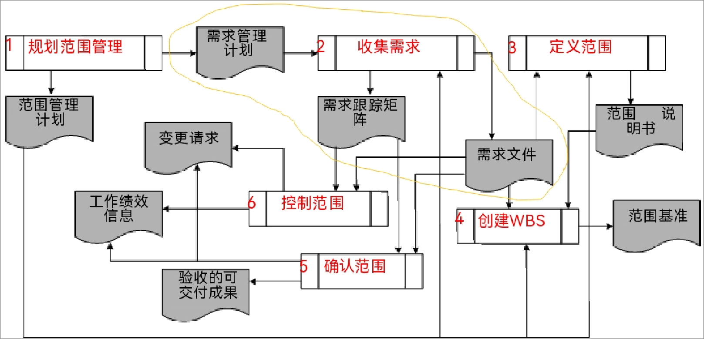

# 软件项目管理与产品运维

## 0. 引言

* 简介
  * 项目管理
    * 在规定的 **时间** 和 **成本** 内，**保质** 并且 **保量** 地完成项目
  * 产品运维
    * 广义: 运营 + 维护
    * 狭义: 维护
  * 项目管理和产品运维的区别

* 组织和管理者
  * 软件组织
    * 开发人员: 是核心！(
    * 产品经理: 负责产品迭代全流程
    * 项目经理: 短期委派，实现项目目标
      * 项目经理 $<$ 产品经理
    * 运维人员
    * 运营人员
    * 职能经理: 管理具体职能部门
  * 管理者
    1. **识别关键问题** 和 **巧妙解答**
    2. 协调工作，完成任务
    3. 影响组织绩效
  * 目标
    1. 低资源浪费（高效率）
    2. 高目标实现（高成效）
  * 管理者需要的技能
    1. 概念
    2. 人际关系
    3. 技术
  * 现代领导理论
    1. 领导者-成员交互理论：小圈子
    2. 魅力型领导：追随者认为领导者具有非凡的领导能力
    3. 变革型领导：采用激励和鼓励方式
    4. 诚信领导：受道德准则指引
    5. *仆人式领导：将跟随着利益置于个人利益之上
      * 敏捷开发常用，没有项目经理，有Master
    * 每种领导理论各有优缺点

* 授课内容

* 考核
  * 50%平时 + 50%考试
  * 平时：课堂测试 + 小组项目
    * 无课后作业！

* 课程作用

***

## 1. 软件项目管理综述

### 1.1 项目和项目管理的基本概念

* 针对项目失败的五个原因中的 —— 管理问题

* 项目vs运维
  * 项目：野餐活动、集体婚礼、开发操作系统、神舟飞船计划
  * 运维：每天上课、社区安保、卫生保洁

* 项目产出
  * 产品，服务，改进，成果

* 项目三角形
  * 质量 + 范围(相似)、费用、时间

* 项目生命周期与阶段
  * 单阶段
  * 多阶段
    * 顺序关系
    * 交叠关系

* 管理项目 <=> 管理项目阶段
  * 因为一个阶段也可以看作一个小项目

* 干系人
  * 受项目影响的人 + 影响项目的人

### 1.2 软件项目和软件项目管理

* 软件项目要素之间的关联
  * 软件项目的200/20/6X现象
  * **人数** 增加1倍，**工期** 缩短20%，**缺陷** 增加6倍
  * 人数 <=> 资源，工期 <=> 时间，缺陷 <=> 质量

* 软件项目 **生命周期**
  * 瀑布模型 => 预测性的过程
  * 敏捷方法 => 自适应的过程
  * 具体问题具体分析
  * 生命周期的关联
    *             少项目变化 -> 多项目变化
    * 低提交频率：预测型，迭代型
    * 高提交频率：增量型，适应型

* 项目经理
  * 联系团队与领导，团队与客户

* 项目团队
  * 经理 + 管理 + 开发

* 项目管理办公室 (PMO)
  * 作用
    1. 管理过程标准化
    2. 促进共享

* 项目集
  * 一系列相互管理且被协调管理的项目等
  * 获得集体利益

* 项目组合
  * 为了实现企业目标，而组合在一起管理的项目

## 2. 组织影响、过程资产 和 事业环境因素

### 2.1 组织对项目管理的影响

* 组织战略

* 组织文化

* 组织结构
  * 项目型 & 职能型

### 2.2 组织过程资产

### 2.3 事业环境因素

## 3. 项目管理知识体系

* 五个过程组
  * 启动：授权开始新项目或阶段，**设定项目愿景**
  * 规划：明确**项目范围**、定义优化**项目目标**、制定**行动方案**
  * 执行：协调人员和资源，管理干系人期望
  * 监控：洞察项目的健康状况
  * 收尾：项目或项目阶段正式结束

* 职能与项目
  * 职能：高效率
  * 项目：高效果

## 4. 项目整合管理

* PMBOK 10大知识领域
  * **核心** 知识领域：范围、时间、成本、质量
  * **辅助** 知识领域：人力资源、沟通、风险、采购、干系人
  * 工具和技术

* 项目流程
  * 构想 -> 可行性分析 --(启动)-> 需求 -> 概要设计 -> 详细设计 -> 开发 -> 测试 -> 部署
  * 准备阶段：构想、可行性分析
  * 启动过程组
  * 规划过程组：需求、概要设计
  * 执行过程组：详细设计、开发
  * 监控过程组：测试
  * 收尾过程组

* 项目整合管理
  1. 制定项目章程
  2. 制定项目管理计划
  3. 指导与管理项目工作
  4. 监控项目工作
  5. 实施整体变更控制
  6. 结束项目或阶段

### 4.1 指定项目章程（启动）

* 内容
  1. 正式批准项目
  2. 任命项目经理
  3. 授权可用资源

* 主要作用
  * 明确定义项目开始和项目边界
  * 任命项目经理
  * 高级管理层明确表述对项目的支持

### 4.2 制定项目管理计划（规划）

* 内容
  1. 定义、编制、整合、协调所有 **子计划**
  2. 整合为一份 **综合** 项目管理计划

* 主要作用
  * 为所有项目工作 **提供依据**

* 将子计划和项目基准等汇总成项目管理计划

### 4.3 指导与管理项目执行（执行）

* 内容
  1. 领导和执行项目管理计划中确定的工作
  2. 指导实施已批准的变更

* 主要作用
  * 对项目工作 **提供全面管理**

* 开发 与 变更

### 4.4 监控项目工作（监控）

* 内容
  1. **跟踪、审查和调整** 项目进展
  2. 实现项目管理计划中确定的绩效目标

* 主要作用
  * 让**干系人**了解项目状况等

* 基本步骤
  * 建立标准
  * 采集数据
  * 比较结果与计划
  * 决定是否修正计划
  * 修正计划

### 4.5 实施整体变更控制（监控）

* 内容
  1. 审查所有变更请求
  2. 是否变更
  3. 管理变更
  4. 沟通变更处理结果

* 主要作用
  * **降低项目风险**

#### 4.5.1 变更请求

* 变更请求：关于修改任何文档、可交付成果、基准的 **正式提议**

#### 4.5.2 变更控制系统

* 组成部分
  1. 变更控制小组：负责项目变更审批
  2. 变更信息沟通：及时沟通项目状况
  3. 配置管理：确保正确性和完整性

## 5. 项目范围管理

* 范围
  * 产品范围
    * 产品的特性和功能
    * 面向 **客户/发起人**
  * 项目范围（工作范围）
    * 需要完成的工作
    * 面向 **项目团队**

* 内容
  * 确保项目 **做且只做** 所需的工作

* 步骤
  1. 规划范围管理
  2. 收集需求
  3. 定义范围
  4. 创建WBS
  5. 确认范围
  6. 控制范围
  * 前4个是规划过程组、后2个是监控过程组
  * 

* 爸爸做晚饭例子
  * 范围：要做什么菜
  * 范围管理：不要少做、不要多做
  * 规划范围管理：
  * 收集需求：**想** 做什么菜（功能性）、菜具体的情况（非功能性）
  * 定义范围：确定 **最终** 要做什么菜
  * 创建工作分解结构：开始做菜
  * 确认范围：看一下做出来菜的 **结果** 满不满足要求
  * 控制范围：看一下做菜的 **过程** 满不满足要求

### 5.1 规划范围管理

* 基本步骤
  1. 决定做什么项目
     * 考虑投资项目的原因（比如有商业价值）
  2. 进行业务分析
  3. 形成可能的项目方案
     * 注重整个组织需要
     * 财务可行性分析
       * 净现值(NPV)分析
         * 将所有预期未来的现金流入和留出都折算成 **现值**，以计算预期的收益与损失
         * 现值：即考虑通货膨胀
       * 投资收益率(ROI)分析
         * 单位成本的利率
       * 投资回收期分析
     * 运用加权评分模型
       * **关联矩阵法**：识别评价标准、赋以权重、对不同方案评分、选取最终方案
       * **二分比较法** => 确定权重系数
       * **等级分法** => 确定价值矩阵
  4. 选择项目方案并分配资源

### 5.2 收集需求

* 需求：项目必须满足的条件或能力、已量化且书面记录
  * 解决方案需求：功能性需求、非功能性需求
  * 业务需求：组织高层需求
  * 干系人需求：相关方的需求
  * 过渡和就绪需求：过程中的需求
  * 项目需求：项目需要满足的行动、过程或其他条件（如里程碑日期）
  * 质量需求：实现项目的任何条件或标准

#### 5.2.1 收集需求 - 过程工具与技术

* 
